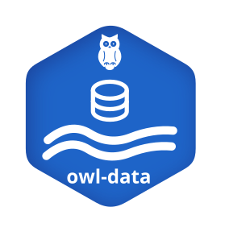

OWL Data
========

The OWL Data module (``owl-data``) provides a unified framework for analysis, validation, cleaning, gap-filling and visualization of data acquired in the context of water and wastewater systems.

Part of `Open Water Lab(OWL) <https://github.com/OpenWaterLab>`_ - free and open-source tools for water system modelling, simulation and analysis.

Created and maintained by: `BIOMATH, UGent <https://github.com/UGentBiomath>`_

OWL Data introduces a structured and extensible approach to working with data from
multiple sources, including online sensors, laboratory measurements, and
external models. The module is designed to support the full data lifecycle,
from raw data ingestion to advanced analysis and gap-filling.

Key Features
------------

- **Unified data model**
  A consistent interface for handling time-indexed datasets across different
  data sources.

- **Flexible data structures**
  Specialized classes for different data types:
  - ``Dataset``: Base class for general time-series data
  - ``SensorDataset``: Continuous, high-frequency sensor data
  - ``LabDataset``: Discrete laboratory and experimental data

- **Data quality and validation**
  Built-in tools for tagging, filtering, and tracking data quality and provenance.

- **Advanced gap-filling methods**
  Multiple approaches for handling missing or invalid data, including:
  - Interpolation and statistical methods
  - Time-series models (ARIMA, Kalman)
  - Machine learning approaches (Gaussian Processes)
  - Domain-informed methods (daily profiles, ratios, previous-day patterns)

- **Evaluation framework**
  Systematic tools to assess and compare gap-filling performance using
  artificial-gap experiments.

- **Extensibility**
  Designed to integrate with broader OWL components such as digital twins,
  knowledge graphs, and decision-support systems.

Purpose
-------

The module aims to provide a robust and transparent foundation for
data analysis and modelling in urban water systems, enabling:

- Reliable preprocessing of heterogeneous datasets
- Reproducible data cleaning and gap-filling workflows
- Integration with simulation models and AI pipelines

API Reference
-------------

.. toctree::
   :maxdepth: 2

   api/index