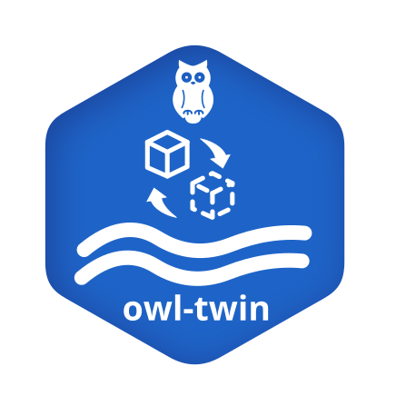

OWL Twin
========

The OWL Twin module (``owl-twin``) provides a framework for building automated digital twin pipelines for urban water systems.

Key Features
------------

Purpose
-------

API Reference
-------------

