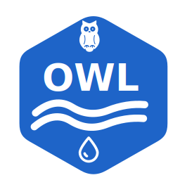

# **OpenWaterLab (OWL)**

  

<h1 align="center">owl</h1>

OpenWaterLab (OWL) is founded, developed and maintained by the **[BIOMATH](https://biomath.ugent.be/)** research group at Ghent University and the wider open-source water research community. It is a free and open-source ecosystem of tools for water system modelling, simulation, analysis, and digital twin development. Contributions of all kinds are welcome and appreciated.

## Packages
- **owl-data** - Data analysis tools for water system modelling and analysis
- **owl-twin** - Digital twin pipelines for water system modelling and analysis
- **owl-wrff** - Modelling and simulations tools for water resource recovery facilities
- **owl-ont** - Ontology and knowledge graph for urban water systems.

