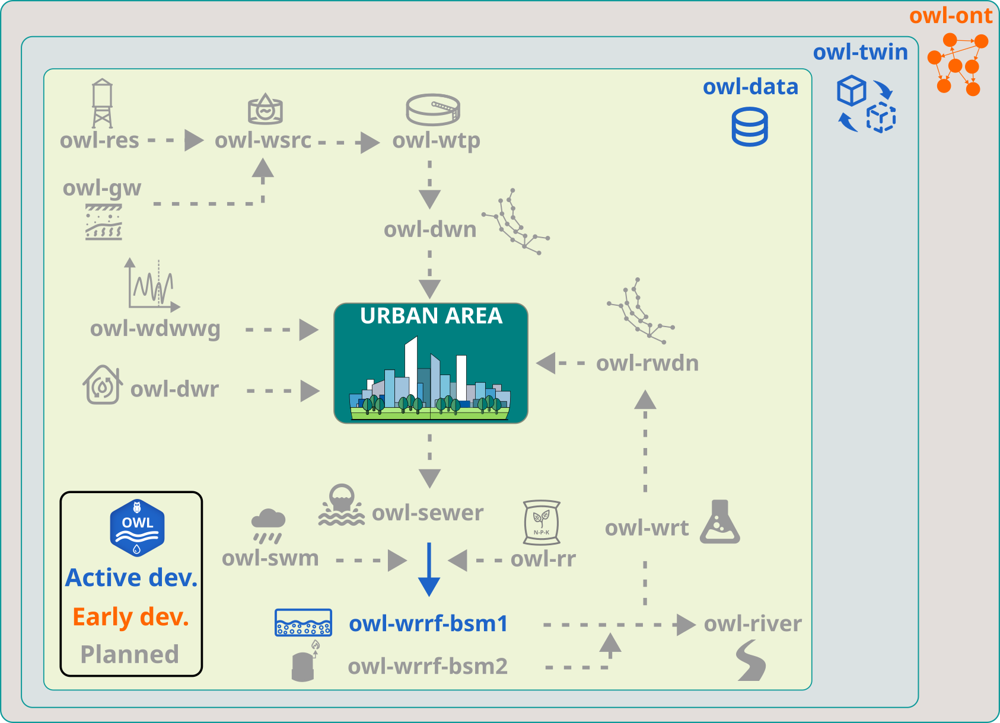

Roadmap
=======

This roadmap outlines the current development priorities and longer-term direction of the **Open Water Lab (OWL)** ecosystem.

It is intended to provide transparency on planned developments, help users understand the maturity of the available tools, and support collaboration with contributors and partners.

The roadmap is indicative and may evolve as the ecosystem grows.The figure below presents the various components envisioned in OWL with their development status.

Current priorities
------

Ecosystem foundations
^^^^^^
- Establish a consistent package structure across the OWL ecosystem
- Maintain unified documentation, branding, and development workflows
- Improve testing, continuous integration, and release practices
- Expand the central documentation website

Core overarching packages
^^^^^^
- Further test and validate `owl-data` for structured handling of water-related datasets
- Further test and validate `owl-twin` for reusable digital twin pipelines and workflows
- Develop first vesion of `owl-ont` as an ontology model for data architecture across OWL ecosystem

Short-term goals
------

`owl-data`
^^^^^^
- Add usage examples and API documentation
- Improve testing coverage for core data workflows

`owl-twin`
^^^^^^
- Add usage examples and API documentation
- Improve testing coverage for core data workflows
- Document integration with OWL data and simulation components

`owl-ont`
^^^^^^
- Develop the first version of the ontology model
- Develop data mapping functionalities for knowledge graph creation
- Add usage examples and API documentation

`owl-wrrf`
^^^^^^
- Test and further fine tune the control schemes in BSM1
- Provide a fully functional BSM1 version
- Add usage examples and API documentation

Mid-term goals
-----

Domain-specific simulation modules
^^^^^^
- Develop ``owl-wsrc`` for water source modelling
- Develop ``owl-wtp`` for drinking water treatment modelling
- Develop ``owl-wdn`` for drinking water distribution modelling
- Develop ``owl-wdwwg`` for water demand and wastewater generation modelling
- Develop ``owl-sewer`` for sewer transport modelling
- Develop ``owl-river`` for river water quality modelling

Documentation and tutorials
^^^^^^
- Add practical tutorials and reproducible example workflows
- Improve package-level and ecosystem-level documentation
- Provide guidance for contributors who want to integrate new models and tools

Community and collaboration
^^^^^^
- Strengthen contribution pathways for external collaborators
- Encourage reuse of OWL tools in research and engineering practice
- Build connections with related open-source and academic initiatives

Long-term vision
-----

The long-term ambition of **Open Water Lab (OWL)** is to provide a modular and extensible ecosystem of free and open-source tools for:

- water data analysis and management
- digital twin development
- simulation and modelling of diverse water systems
- reproducible and transparent scientific workflows
- integration of water models across scales and domains

In the long-term OWL plans to include more advanced urban water system components including:

- ``owl-res`` for water reservoir modelling
- ``owl-gw`` for groundwater modelling
- ``owl-dwr`` for decentralized water treatment modelling
- ``owl-swm`` for stormwater management modelling
- ``owl-rwdn`` for reclaimed water distribution modelling
- ``owl-wrt`` for advanced water reuse process modelling
- ``owl-wrrf-bsm2`` for plant-wide wastewater and sludge treatment modelling
- ``owl-rr`` for resource recovery modelling 

Development status overview
-----
+----------------+--------------------+--------------------------------------------------+
| **OWL module** | **Status**         | **Description**                                  |
+----------------+--------------------+--------------------------------------------------+
| ``owl-data``   | Active development | Data handling and validation                     |
+----------------+--------------------+--------------------------------------------------+
| ``owl-twin``   | Active development | Automated digital twin pipelines                 |
+----------------+--------------------+--------------------------------------------------+
| ``owl-wrrf``   | Active development | Water reource recovery facility modelling        |
+----------------+--------------------+--------------------------------------------------+
| ``owl-ont``    | Early development  | Ontology and dynamic knowledge graph             |
+----------------+--------------------+--------------------------------------------------+
| ``owl-wsrc``   | Planned            | Water source node modelling                      |
+----------------+--------------------+--------------------------------------------------+
| ``owl-wtp``    | Planned            | Water treatment modelling                        |
+----------------+--------------------+--------------------------------------------------+
| ``owl-wdn``    | Planned            | Water distribution network modelling             |
+----------------+--------------------+--------------------------------------------------+
| ``owl-wdwwg``  | Planned            | Water demand and wastewater generation modelling |
+----------------+--------------------+--------------------------------------------------+
| ``owl-sewer``  | Planned            | Sewer network modelling                          |
+----------------+--------------------+--------------------------------------------------+
| ``owl-river``  | Planned            | River water quality modelling                    |
+----------------+--------------------+--------------------------------------------------+

Contributing to the roadmap
-----

Contributions, suggestions, and feedback are welcome.

If you would like to propose a new feature, package, or domain-specific extension, please open an issue or discussion in the relevant repository or contact the OWL maintainers through the project channels.